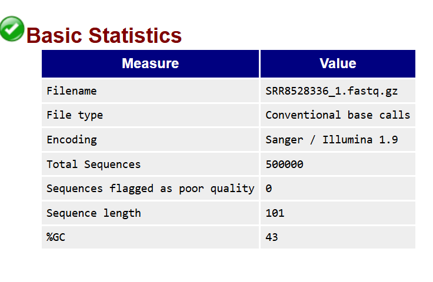
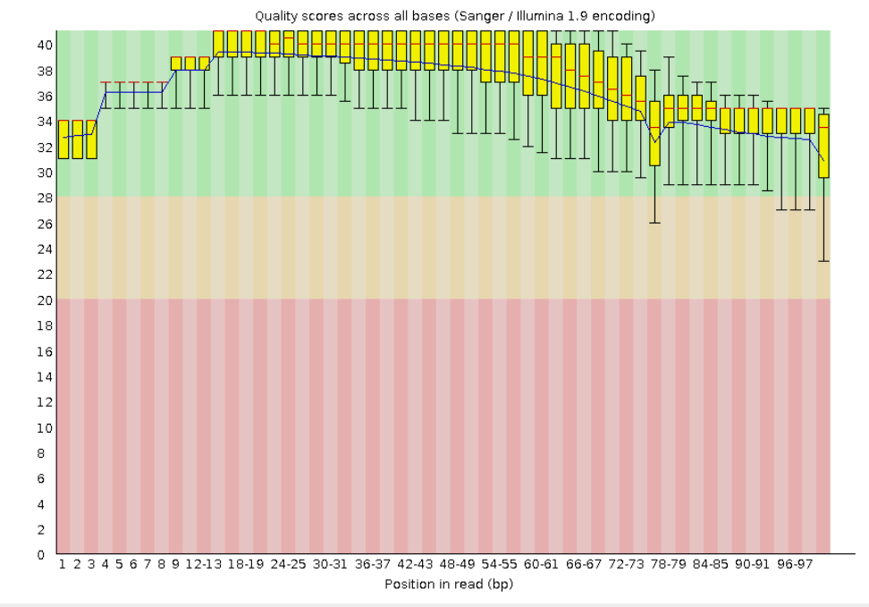
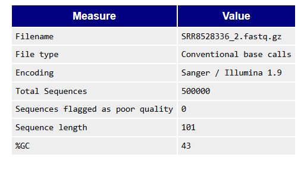

# parcial2_bioinformatica_Catalina_Lara
Parcial 2
# Punto 1: Calidad y Ensamblaje Genómico *De Novo*
Se realizó el análisis de calidad de las lecturas crudas y el ensamblaje *de novo* del genoma de _Gasteracantha cancriformis_. 
Evaluación de calidad de las lecturas

Se evaluó la calidad de las secuencias utilizando **FastQC**, y el código utilizado fue :
```bash
fastqc *.fastq.gz
# Archivos FASTQ
Por cada archivo FASTQ se generaron los siguientes reportes:
# SRR8528336_1_fastqc.html
# SRR8528336_1_fastqc.zip
# SRR8528336_2_fastqc.html
# SRR8528336_2_fastqc.zip

Se descargaron los archivos .html
# SRR8528336_1_fastqc.html


# SRR8528336_2_fastqc.html

file://wsl$/Ubuntu/root/SRR8528336_2_fastqc.html



Para evaluar la calidad de las lecturas se utilizó el software FastQC.
A partir de este análisis se observó que los archivos SRR8528336_1.fastq.gz y SRR8528336_2.fastq.gz contienen cada uno 500,000 secuencias, sin lecturas marcadas como de baja calidad, con una longitud uniforme de 101 pb y un contenido GC de 43%, lo cual se encuentra dentro de lo esperado y no sugiere problemas de contaminación.

En cuanto a la calidad por base, la mayoría de las posiciones presentan valores de Phred mayores a 30,
lo que indica que las lecturas son confiables.También se observa que la calidad se mantiene bastante estable a lo largo de la secuencia.

# PRIMER PUNTO (2)
Se Utilizo SPAdes para realizar el ensamblaje de novo utilizando los reads, en un sbatch con este código:

#!/bin/sh
#SBATCH -p normal #Particion (cola)
#SBATCH -N 1 # Numero de nodos
#SBATCH -n 8 # Numero de nucleos
#SBATCH -t 1-20:00 # limite de tiempo (D-HH:MM)
#SBATCH -o salida.out # Salida STDOUT
#SBATCH -e error.err # Salida STDERR
#SBATCH --mail-user=laurac.lara@urosario.edu.co #Direccion e-mail a donde notificar el estado del trabajo
#SBATCH --mail-type=ALL #Especifica que eventos notificar al correo (ALL, BEGIN, END, REQUEUE, FAIL)

module load spades
spades.by -1 SRR8528336_1.fastq.gz -2 SRR8528336_2.fastq.gz -o ensamblaje_spades

#Las métricas del ensamblaje fueron calculadas utilizando QUAST. Con el siguiente código:
 
quast.py scaffolds.fasta -o quast_results

# PRIMER PUNTO (3)
Una vez finalizado el ensamblaje de novo, se calcularon las estadísticas del ensamblaje utilizando el software QUAST, a partir del archivo de scaffolds generado por SPAdes.
El comando utilizado fue:
# /datacnmat01/ciencias/appsbio/conda/pkgs/quast-5.2.0-py39pl5321h4e691d4_3/opt/quast-5.2.0/quast.py scaffolds.fasta -o quast_results
Resultados 

Interpretación:
El ensamblaje obtenido presenta un N50 de 1329 bp y un L50 de 454, lo que indica que el genoma se encuentra fragmentado en múltiples contigs pequeños. Esto sugiere una baja contigüidad.

#SEGUNDO PUNTO
En este punto se buscó identificar un gen ortólogo al *ommochrome-binding protein (OBP)* en el genoma ensamblado de _Gasteracantha cancriformis_.

Se obtuvieron secuencias proteicas relacionadas con el gen OBP a partir de los siguientes códigos de acceso:

* NM_079118.3  
* NM_079632.4  
* XM_016049029.1  
* XM_016049030.1  

Las secuencias fueron descargadas en formato FASTA desde NCBI.
## Construcción de base de datos local
A partir del archivo `contigs.fasta` generado en el ensamblaje, se construyó una base de datos de nucleótidos utilizando BLAST.
### Código utilizado
makeblastdb -in contigs.fasta -dbtype nucl -out contigs_db
## Concatenación de secuencias
Las secuencias proteicas descargadas se unieron en un único archivo:
cat NM_079118.3_protein.fasta NM_079632.4_protein.fasta XM_016049029.1_protein.fasta XM_016049030.1_protein.fasta > obp_proteins.fasta
##Limpieza de encabezados (expresiones regulares)
Se utilizó el editor Atom para modificar los encabezados de las secuencias mediante expresiones regulares, dejando únicamente el identificador de acceso y el nombre de la especie.

##Búsqueda de similitud (BLAST)
Se realizó una búsqueda utilizando tblastn, comparando secuencias proteicas contra la base de datos de nucleótidos generada a partir del ensamblaje. Con el siguiente código :

tblastn -query obp_proteins_ex.fasta -db contigs_db -out resultados_tblastn.out -outfmt 6


## 🧠 Interpretación de resultados BLAST

A partir de los resultados obtenidos mediante `tblastn`, se identificaron múltiples alineamientos entre las proteínas de referencia y los contigs del ensamblaje. Sin embargo, no todos los hits tienen la misma relevancia biológica, por lo que se evaluaron principalmente los parámetros de **E-value**, **porcentaje de identidad** y **longitud de alineamiento**.

El mejor alineamiento corresponde al contig:

* **Contig:** NODE_2981_length_349_cov_1.095238  
* **E-value:** 7.34e-33  
* **Identidad:** 88.13%  
* **Longitud de alineamiento:** 59 aa  

Este resultado es altamente significativo, ya que el E-value esmextremadamente bajo. Además, el alto porcentaje de identidad sugiere una fuerte conservación de la secuencia entre la proteína de referencia y la región encontrada en el ensamblaje.

Aunque existen otros alineamientos con E-values bajos (por ejemplo, en los contigs NODE_2192 y NODE_89), estos presentan menores porcentajes de identidad o corresponden a fragmentos más cortos o repetidos, lo que disminuye su confiabilidad como candidatos principales.

Estos resultados indican que el contig NODE_2981 es el mejor candidato para contener un gen ortólogo al *ommochrome-binding protein (OBP)* en _Gasteracantha cancriformis_.

#PUNTO TRES
Relación entre Altitud, Temperatura y Morfos de Color

## Metodología

Para la visualización de los datos se utilizó la librería **ggplot2** en R, que permite generar gráficos de alta calidad y personalizables.

- Para la gráfica de abundancia relativa por altitud se empleó `geom_area()`, lo que permitió representar la **densidad apilada** de los diferentes morfos de color a lo largo del gradiente altitudinal.
- Para la relación entre temperatura y supervivencia se utilizó `geom_point()`, facilitando la visualización de la dispersión de los datos y las diferencias entre fenotipos.

---

##  Resultados

###  Abundancia relativa por altitud


###  Supervivencia en función de la temperatura


##  Interpretación

A partir de las gráficas obtenidas, se observa que la distribución de los morfos de color varía a lo largo del gradiente altitudinal. En particular, el morfo rojo presenta una mayor abundancia en altitudes más bajas, mientras que el morfo amarillo aumenta su frecuencia en altitudes intermedias y altas. El morfo blanco presenta una menor abundancia relativa en comparación con los otros fenotipos.

Por otro lado, la gráfica de temperatura muestra que la probabilidad de supervivencia aumenta con la temperatura en los tres morfos, aunque con diferencias entre ellos. El morfo rojo alcanza valores más altos de supervivencia en temperaturas elevadas, mientras que los otros fenotipos presentan respuestas más moderadas.

Dado que la temperatura tiende a disminuir con la altitud, los patrones observados sugieren una relación indirecta entre estas variables. La distribución de los morfos podría estar influenciada por su tolerancia a diferentes rangos térmicos.

Estos resultados sugieren que la variación en la coloración podría estar asociada a procesos de adaptación local. Cada morfo de color podría tener ventajas en ciertos ambientes, lo que indicaría la acción de la selección natural.


